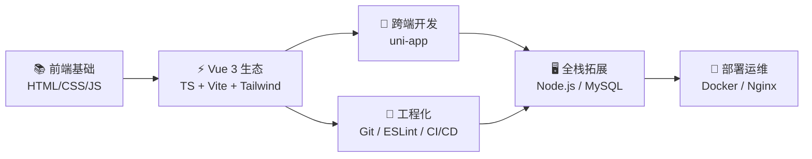

  <h1>Hi, I'm Violet Viper 🎯</h1>
  

    <b>大二在读 · Vue 3 前端方向 · 全栈发展中</b>
  

  

    
    
    
  

---

## 🛠️ 技术栈

### 🥇 第一梯队 · 必备技能

  
  
  
  

  
  

### 🥈 第二梯队 · 加分项

  
  
  
  

  
  
  

### 🥉 第三梯队 · 了解即可

  
  
  
  
  

---

## 🤖 AI Coding 工具

<table align="center">
  <tr>
    <td align="center"><b>✅ 已在使用</b></td>
    <td align="center"><b>🔍 了解探索中</b></td>
  </tr>
  <tr>
    <td>
      

        
        
        
      

    </td>
    <td>
      

        
        
      

    </td>
  </tr>
</table>

---

## 🎯 学习路线

> **从开发到上线的完整闭环**：Vue 3 写业务 → Vite 构建 → uni-app 跨端分发 → Node.js 后端 → Docker + Nginx 部署

---

## 📚 学习动态

| 板块 | 状态 | 优先级 | 重点 |
|:---|:---:|:---:|:---|
| HTML5 / CSS3 | 🟢 进行中 | 🥇 | 响应式 / Flexbox / Grid / 动画 |
| JavaScript / ES6+ | 🟢 进行中 | 🥇 | 原型链 / 闭包 / 异步 / Promise |
| Vue 3 + Composition API | 🟡 即将开始 | 🥇 | 组件化 / Pinia / Vue Router |
| TypeScript | 🟡 即将开始 | 🥇 | 类型系统 / 泛型 / 工具类型 |
| Vite + Tailwind CSS | 🟡 即将开始 | 🥇 | 构建配置 / 原子化 CSS |
| uni-app 跨端 | ⚪ 规划中 | 🥇 | 多端适配 / 小程序发布 |
| Git / ESLint / Prettier | 🟡 即将开始 | 🥈 | 版本控制 / 代码规范 |
| Node.js / MySQL | ⚪ 规划中 | 🥉 | RESTful API / 数据库设计 |
| Docker / Nginx | ⚪ 规划中 | 🥉 | 容器化 / 反向代理 / SSL |

---

  
  
⭐ <i>Keep coding, keep growing!</i>

