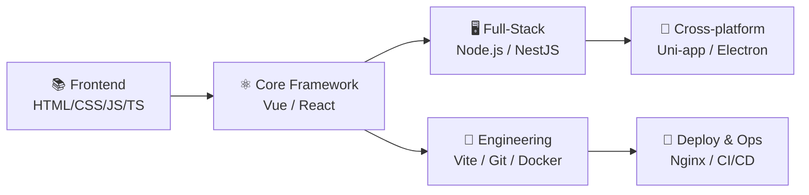

# Hi, I'm Violet Viper 🎯

  

  
  
  
  &nbsp;&nbsp;&nbsp;&nbsp;&nbsp;&nbsp;&nbsp;&nbsp;&nbsp;&nbsp;&nbsp;&nbsp;
  
  
  

---

## 🛠 Tech Stack

<table>
  <tr>
    <td valign="top" width="50%">
      <h4>🔷 Frontend Basics</h4>
      

        
        
        
        
        
      

    </td>
    <td valign="top" width="50%">
      <h4>🔶 Frameworks & Full Stack</h4>
      

        
        
        
      

    </td>
  </tr>
  <tr>
    <td valign="top" width="50%">
      <h4>🟢 Engineering & Deploy</h4>
      

        
        
        
        
        
      

    </td>
    <td valign="top" width="50%">
      <h4>🟣 Cross-platform & Desktop</h4>
      

        
        
      

    </td>
  </tr>
  <tr>
    <td valign="top" width="50%">
      <h4>🗄️ Databases</h4>
      

        
        
        
      

    </td>
    <td valign="top" width="50%">
      <h4>🧰 Toolchain</h4>
      

        
        
        
      

    </td>
  </tr>
</table>

---

## 🎯 Learning Roadmap

> From development to production: Dev → Build → Deploy

---

## 📚 Learning Progress

  <table>
    <tr>
      <th width="200">Module</th>
      <th width="100">Progress</th>
      <th width="400">Focus</th>
    </tr>
    <tr>
      <td>HTML5 / CSS3</td>
      <td>
        
      </td>
      <td>Responsive Layout / Flexbox / Grid / CSS Animations</td>
    </tr>
    <tr>
      <td>JavaScript / TypeScript</td>
      <td>
        
      </td>
      <td>ES6+ Syntax / Type System / Async / Promise</td>
    </tr>
    <tr>
      <td>Vue 3 Ecosystem</td>
      <td>
        
      </td>
      <td>Composition API / Pinia / Vue Router / Vite</td>
    </tr>
    <tr>
      <td>Node.js Backend</td>
      <td>
        
      </td>
      <td>Express / RESTful API / Database</td>
    </tr>
    <tr>
      <td>Engineering & Deploy</td>
      <td>
        
      </td>
      <td>Docker Basics / Nginx / CI/CD</td>
    </tr>
  </table>

---

  

  <i>"心静能通万事理 &nbsp;&nbsp;&nbsp;&nbsp; 心平能愈三千疾 ."</i>

