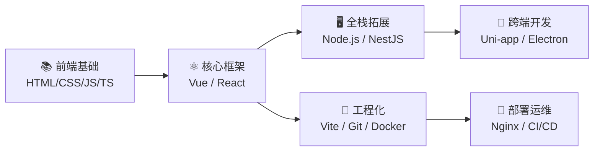

  <h1>Hi, I'm Violet Viper 🎯</h1>
  

    <b>大二在读 · 前端方向 · 全栈学习者</b>
  

  

    
    
  

---

## 🛠️ 技术栈

<table>
  <tr>
    <td valign="top" width="33%">
      <h4 align="center">🔷 前端基础</h4>
      

        
        
        
        
        
      

    </td>
    <td valign="top" width="33%">
      <h4 align="center">🔶 框架 & 全栈</h4>
      

        
        
        
        
        
      

    </td>
    <td valign="top" width="33%">
      <h4 align="center">🟢 工程化 & 部署</h4>
      

        
        
        
        
        
      

    </td>
  </tr>
</table>

<table>
  <tr>
    <td valign="top" width="33%">
      <h4 align="center">🟣 跨端 & 桌面</h4>
      

        
        
      

    </td>
    <td valign="top" width="33%">
      <h4 align="center">🗄️ 数据库</h4>
      

        
        
        
      

    </td>
    <td valign="top" width="33%">
      <h4 align="center">🧰 工具链</h4>
      

        
        
        
      

    </td>
  </tr>
</table>

---

## 🎯 学习路线

> **从开发到上线的完整闭环**：开发（框架写业务）→ 构建（Vite 打包）→ 部署（Nginx + Docker + CI/CD）

---

## 📚 学习动态

| 板块 | 状态 | 重点 |
|:---|:---:|:---|
| HTML5 / CSS3 | 🟢 进行中 | 响应式布局 / Flexbox / Grid / 动画 |
| JavaScript / TypeScript | 🟡 待开始 | ES6+ / 类型系统 / 异步编程 |
| Vue / React | ⚪ 规划中 | 组件化 / 状态管理 / 路由 |
| Node.js / NestJS | ⚪ 规划中 | RESTful API / 数据库 / 认证 |
| 工程化 / CI/CD | ⚪ 规划中 | Vite 构建 / Docker 部署 / 自动化 |

---

## 🚀 项目

 

---

  
  
⭐ <i>Keep coding, keep growing!</i>

