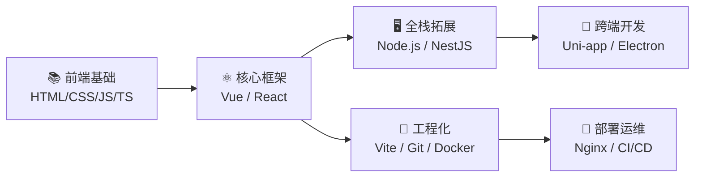

# Hi, I'm Violet Viper 🎯

  

  
  
  

---

## 🛠 技术栈

  标签前缀 = 掌握程度：
  
  
  
  

<table>
  <tr>
    <td valign="top" width="50%">
      <h4>🔷 前端基础</h4>
      

        
        
        
        
        
      

    </td>
    <td valign="top" width="50%">
      <h4>🔶 框架 & 全栈</h4>
      

        
        
        
        
        
      

    </td>
  </tr>
  <tr>
    <td valign="top" width="50%">
      <h4>🟢 工程化 & 部署</h4>
      

        
        
        
        
        
      

    </td>
    <td valign="top" width="50%">
      <h4>🟣 跨端 & 桌面</h4>
      

        
        
      

    </td>
  </tr>
  <tr>
    <td valign="top" width="50%">
      <h4>🗄️ 数据库</h4>
      

        
        
        
      

    </td>
    <td valign="top" width="50%">
      <h4>🧰 工具链</h4>
      

        
        
        
      

    </td>
  </tr>
  <tr>
    <td valign="top" width="100%" colspan="2">
      <h4>🤖 AI 工具</h4>
      

        
        
        
        
        
      

    </td>
  </tr>
</table>

---

## 🎯 学习路线

> 从开发到上线的完整闭环：开发 → 构建 → 部署

---

## 📚 学习动态

  <table>
    <tr>
      <th width="200">模块</th>
      <th width="100">进度</th>
      <th width="400">当前重点</th>
    </tr>
    <tr>
      <td>HTML5 / CSS3</td>
      <td>
        
      </td>
      <td>响应式布局 / Flexbox / Grid / CSS动画</td>
    </tr>
    <tr>
      <td>JavaScript / TypeScript</td>
      <td>
        
      </td>
      <td>ES6+语法 / 类型系统 / 异步编程 / Promise</td>
    </tr>
    <tr>
      <td>Vue 3 全家桶</td>
      <td>
        
      </td>
      <td>Composition API / Pinia / Vue Router / Vite</td>
    </tr>
    <tr>
      <td>Node.js 后端</td>
      <td>
        
      </td>
      <td>Express / RESTful API / 数据库操作</td>
    </tr>
    <tr>
      <td>工程化与部署</td>
      <td>
        
      </td>
      <td>Docker基础 / Nginx配置 / CI/CD</td>
    </tr>
  </table>

---

  

  <i>"Keep coding, keep growing. 代码不止，进步不停。"</i>

